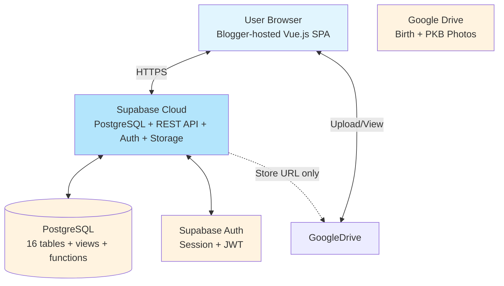
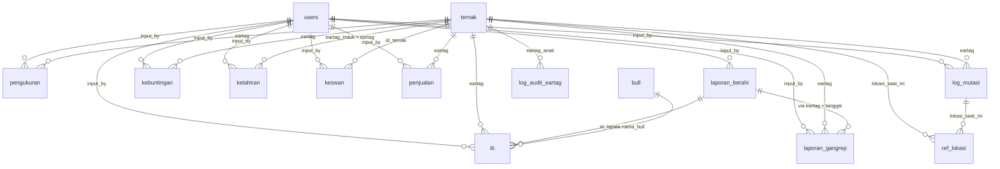

# SISCOPATAS — Supabase + Blogger Migration Plan

## Overview

**SISCOPATAS** (Smart Integrated System for Cattle Performance Analytics) is a complete livestock farm management system for **BPTUHPT Padang Mengatas**, a cattle breeding and artificial insemination center in Indonesia. Currently it runs on Google Sheets (database) + Google Apps Script (backend REST API) + Blogger (frontend Vue.js 2 SPA hosting).

## Target Architecture

```
Blogger (Vue.js 2 SPA)
    ↕ HTTPS + Supabase JS Client
Supabase (PostgreSQL + REST API + Auth)
    ↕ Row Level Security
PostgreSQL Database (18 tables, functions, views)
    ↕ Google Drive (foto kelahiran + foto PKB via link)
```

## System Context Diagram



---

## 1. Database Schema

### 1.1 ENUM Types

```sql
CREATE TYPE rumpun_ternak AS ENUM (
    'Simmental', 'Limousin', 'Pesisir', 'Brahman', 
    'Belgian Blue', 'FH', 'Silangan', 'Lokal'
);

CREATE TYPE jenis_kelamin AS ENUM ('Jantan', 'Betina');

CREATE TYPE status_ternak AS ENUM ('Hidup', 'Mati', 'Jual', 'Hibah', 'Pindah');

CREATE TYPE status_registrasi AS ENUM ('Aset', 'Persediaan');

CREATE TYPE kategori_ternak AS ENUM ('Anak', 'Muda', 'Dewasa');

CREATE TYPE grade_sni AS ENUM (
    'Grade 1', 'Grade 2', 'Grade 3', 'Non SNI', 'Belum Ada SNI'
);

CREATE TYPE rekomendasi_seleksi AS ENUM (
    'Replacement', 'Distribusi', 'Hold'
);

CREATE TYPE periode_ukur AS ENUM (
    'Lahir', 'Sapih', '9 Bulan', '12 Bulan', 
    '15 Bulan', '18 Bulan', '21 Bulan', '24 Bulan'
);

CREATE TYPE hasil_pemeriksaan AS ENUM ('Positif', 'Negatif', 'Dubius');

CREATE TYPE derajat_berahi AS ENUM ('1', '2', '3', '4');

CREATE TYPE status_ib AS ENUM ('Belum', 'Sudah');

CREATE TYPE status_gangrep AS ENUM (
    'Open', 'Dalam Penanganan', 'Selesai', 'Kronis', 'Tidak Layak IB'
);

CREATE TYPE user_role AS ENUM (
    'Super Admin', 'Admin Wasbit', 'User Wasbit', 
    'Admin Keswan', 'User Keswan', 
    'Admin IJP', 'User IJP', 'Viewer'
);

CREATE TYPE status_distribusi AS ENUM (
    'Lokal', 'Keluar Daerah', 'Teregistrasi'
);
```

### 1.2 Tables

#### Entity Relationship Diagram



#### Table: `users`

| Column | Type | Constraints | Notes |
|--------|------|-------------|-------|
| id_user | UUID | PK DEFAULT gen_random_uuid() | |
| username | VARCHAR(100) | UNIQUE NOT NULL | |
| password_hash | VARCHAR(255) | NOT NULL | bcrypt hash |
| role | user_role | NOT NULL | |
| status | VARCHAR(20) | DEFAULT 'Aktif' | 'Aktif' / 'Tidak Aktif' |
| permissions | JSONB | DEFAULT '[]' | Array of menu ID strings |
| created_at | TIMESTAMPTZ | DEFAULT NOW() | |

```sql
CREATE TABLE users (
    id_user UUID PRIMARY KEY DEFAULT gen_random_uuid(),
    username VARCHAR(100) UNIQUE NOT NULL,
    password_hash VARCHAR(255) NOT NULL,
    role user_role NOT NULL,
    status VARCHAR(20) DEFAULT 'Aktif' CHECK (status IN ('Aktif', 'Tidak Aktif')),
    permissions JSONB DEFAULT '[]'::jsonb,
    created_at TIMESTAMPTZ DEFAULT NOW()
);
```

#### Table: `petugas_reproduksi`

| Column | Type | Constraints | Notes |
|--------|------|-------------|-------|
| id_petugas | UUID | PK | |
| nama_petugas | VARCHAR(200) | NOT NULL | |
| jabatan | VARCHAR(100) | | |
| input_by | UUID | FK → users.id_user | |

#### Table: `petugas_keswan`

| Column | Type | Constraints | Notes |
|--------|------|-------------|-------|
| id_petugas | UUID | PK | |
| nama_petugas | VARCHAR(200) | NOT NULL | |
| jabatan | VARCHAR(100) | | |
| input_by | UUID | FK → users.id_user | |

#### Table: `bull`

| Column | Type | Constraints | Notes |
|--------|------|-------------|-------|
| id_bull | UUID | PK | |
| nama_bull | VARCHAR(200) | NOT NULL | |
| rumpun | rumpun_ternak | NOT NULL | |
| asal | VARCHAR(200) | | Origin / source |
| stok_awal | INTEGER | DEFAULT 0 | |
| stok_saat_ini | INTEGER | DEFAULT 0 | |
| input_by | UUID | FK → users.id_user | |

#### Table: `ref_lokasi`

| Column | Type | Constraints | Notes |
|--------|------|-------------|-------|
| id_lokasi | UUID | PK | |
| nama_lokasi | VARCHAR(200) | NOT NULL | |
| nama_blok | VARCHAR(200) | | Optional sub-location |
| status | VARCHAR(20) | DEFAULT 'Aktif' | 'Aktif' / 'Tidak Aktif' |

#### Table: `ternak` (Core — Database Ternak)

| Column | Type | Constraints | Notes |
|--------|------|-------------|-------|
| id_ternak | UUID | PK | |
| eartag | VARCHAR(50) | UNIQUE NOT NULL | Primary identifier |
| rumpun_ternak | rumpun_ternak | NOT NULL | |
| tanggal_lahir | DATE | NOT NULL | |
| jenis_kelamin | jenis_kelamin | NOT NULL | |
| bapak | VARCHAR(200) | | Sire name |
| induk | VARCHAR(50) | FK → ternak.eartag | Dam eartag |
| status_ternak | status_ternak | DEFAULT 'Hidup' | |
| **registrasi** | **status_registrasi** | **DEFAULT 'Persediaan'** | **Status pencatatan: Aset / Persediaan** |
| tanggal_kejadian | DATE | | Death/sale date |
| lokasi_saat_ini | UUID | FK → ref_lokasi.id_lokasi | |
| catatan | TEXT | | |
| input_by | UUID | FK → users.id_user | |
| created_at | TIMESTAMPTZ | DEFAULT NOW() | |

**Generated / Computed Columns:**

| Column | Type | Formula |
|--------|------|---------|
| umur_bulan | INTEGER | `AGE(CURRENT_DATE, tanggal_lahir)` in months |
| kategori | kategori_ternak | `CASE WHEN umur_bulan <= 6 THEN 'Anak' WHEN umur_bulan <= 18 THEN 'Muda' ELSE 'Dewasa' END` |

These will be implemented as PostgreSQL generated columns or as a view.

```sql
-- Alternative: use a VIEW for computed fields
CREATE VIEW v_ternak AS
SELECT 
    *,
    EXTRACT(YEAR FROM AGE(CURRENT_DATE, tanggal_lahir)) * 12 + 
    EXTRACT(MONTH FROM AGE(CURRENT_DATE, tanggal_lahir)) AS umur_bulan,
    CASE 
        WHEN EXTRACT(YEAR FROM AGE(CURRENT_DATE, tanggal_lahir)) * 12 + 
             EXTRACT(MONTH FROM AGE(CURRENT_DATE, tanggal_lahir)) <= 6 THEN 'Anak'::kategori_ternak
        WHEN EXTRACT(YEAR FROM AGE(CURRENT_DATE, tanggal_lahir)) * 12 + 
             EXTRACT(MONTH FROM AGE(CURRENT_DATE, tanggal_lahir)) <= 18 THEN 'Muda'::kategori_ternak
        ELSE 'Dewasa'::kategori_ternak
    END AS kategori
FROM ternak;
```

#### Table: `log_mutasi`

| Column | Type | Constraints | Notes |
|--------|------|-------------|-------|
| id_mutasi | UUID | PK | |
| tanggal_mutasi | DATE | NOT NULL | |
| eartag | VARCHAR(50) | FK → ternak.eartag | |
| dari_lokasi | VARCHAR(200) | | Free text or FK |
| lokasi_saat_ini | UUID | FK → ref_lokasi.id_lokasi | |
| alasan | VARCHAR(200) | | |
| input_by | UUID | FK → users.id_user | |

#### Table: `laporan_berahi`

| Column | Type | Constraints | Notes |
|--------|------|-------------|-------|
| id_lapor | UUID | PK | |
| tanggal_lapor | DATE | NOT NULL | |
| eartag | VARCHAR(50) | FK → ternak.eartag | |
| rumpun | rumpun_ternak | NOT NULL | |
| derajat_berahi | derajat_berahi | NOT NULL | 1-4 |
| rekomendasi | VARCHAR(100) | | e.g. 'Layak IB', etc. |
| keterangan | TEXT | | |
| status_ib | status_ib | DEFAULT 'Belum' | |
| input_by | UUID | FK → users.id_user | |
| created_at | TIMESTAMPTZ | DEFAULT NOW() | |

#### Table: `ib`

| Column | Type | Constraints | Notes |
|--------|------|-------------|-------|
| id_ib | UUID | PK | |
| id_lapor | UUID | FK → laporan_berahi.id_lapor (NULLABLE) | |
| tanggal_ib | DATE | NOT NULL | |
| eartag | VARCHAR(50) | FK → ternak.eartag | |
| rumpun | rumpun_ternak | NOT NULL | |
| derajat_berahi | derajat_berahi | NOT NULL | |
| nama_bull | VARCHAR(200) | NOT NULL | Bull used |
| inseminator | VARCHAR(200) | NOT NULL | FK → petugas_reproduksi.nama_petugas |
| input_by | UUID | FK → users.id_user | |
| created_at | TIMESTAMPTZ | DEFAULT NOW() | |

#### Table: `keswan` (Kesehatan Hewan)

| Column | Type | Constraints | Notes |
|--------|------|-------------|-------|
| id_keswan | UUID | PK | |
| tanggal | DATE | NOT NULL | |
| id_ternak | UUID | FK → ternak.id_ternak | |
| eartag | VARCHAR(50) | | Denormalized for convenience |
| diagnosa | TEXT | NOT NULL | |
| treatment | TEXT | | |
| petugas | VARCHAR(200) | FK → petugas_keswan.nama_petugas | |
| input_by | UUID | FK → users.id_user | |

#### Table: `laporan_gangrep` (Gangguan Reproduksi)

| Column | Type | Constraints | Notes |
|--------|------|-------------|-------|
| id_gangrep | UUID | PK | |
| tanggal_lapor | DATE | NOT NULL | |
| eartag | VARCHAR(50) | FK → ternak.eartag | |
| rumpun | rumpun_ternak | NOT NULL | |
| keterangan_pelapor | TEXT | | |
| diagnosa_keswan | TEXT | | |
| tindakan_keswan | TEXT | | |
| petugas_keswan | VARCHAR(200) | FK → petugas_keswan.nama_petugas | |
| status_akhir | status_gangrep | DEFAULT 'Open' | |
| input_by | UUID | FK → users.id_user | |
| created_at | TIMESTAMPTZ | DEFAULT NOW() | |

#### Table: `kebuntingan` (PKB — Pemeriksaan Kebuntingan)

| Column | Type | Constraints | Notes |
|--------|------|-------------|-------|
| id_pkb | UUID | PK | |
| eartag | VARCHAR(50) | FK → ternak.eartag | |
| rumpun | rumpun_ternak | NOT NULL | |
| tanggal_ib | DATE | NOT NULL | Linked to IB |
| tanggal_pemeriksaan | DATE | NOT NULL | |
| hasil_pemeriksaan | hasil_pemeriksaan | NOT NULL | Positif/Negatif/Dubius |
| prediksi_bulan | INTEGER | | Gestation months |
| hpl | DATE | | Partus date = tangga_ib + 270 days |
| petugas_pemeriksa | VARCHAR(200) | FK → petugas_reproduksi.nama_petugas | |
| **link_foto_pkb** | **TEXT** | | **URL Google Drive hasil foto USG/pemeriksaan** |
| input_by | UUID | FK → users.id_user | |

#### Table: `kelahiran`

| Column | Type | Constraints | Notes |
|--------|------|-------------|-------|
| id_kelahiran | UUID | PK | |
| tanggal_lahir | DATE | NOT NULL | |
| eartag_induk | VARCHAR(50) | FK → ternak.eartag | Dam |
| rumpun_induk | rumpun_ternak | NOT NULL | |
| eartag_anak | VARCHAR(50) | UNIQUE NOT NULL | Auto-generated NS code |
| jenis_kelamin | jenis_kelamin | NOT NULL | |
| rumpun_anak | rumpun_ternak | NOT NULL | |
| bapak | VARCHAR(200) | | Sire |
| link_foto | TEXT | | Google Drive URL (thumbnail) |
| input_by | UUID | FK → users.id_user | |
| created_at | TIMESTAMPTZ | DEFAULT NOW() | |

#### Table: `pengukuran`

| Column | Type | Constraints | Notes |
|--------|------|-------------|-------|
| id_ukur | UUID | PK | |
| tanggal_ukur | DATE | NOT NULL | |
| eartag | VARCHAR(50) | FK → ternak.eartag | |
| rumpun | rumpun_ternak | NOT NULL | |
| sex | jenis_kelamin | NOT NULL | |
| tanggal_lahir | DATE | NOT NULL | |
| bapak | VARCHAR(200) | | |
| induk | VARCHAR(50) | | |
| periode_ukur | periode_ukur | NOT NULL | |
| panjang_badan | NUMERIC(5,1) | | PB in cm |
| lingkar_dada | NUMERIC(5,1) | | LD in cm |
| tinggi_pundak | NUMERIC(5,1) | | TP in cm |
| berat_badan | NUMERIC(6,1) | | BB in kg |
| lingkar_scrotum | NUMERIC(4,1) | | LS in cm (Jantan only) |
| penilaian_kualitatif | VARCHAR(50) | | 'Sesuai SNI' / 'Tidak Sesuai SNI' |
| keterangan | TEXT | | |
| grade_sni | grade_sni | | Calculated |
| rekomendasi_seleksi | rekomendasi_seleksi | | Calculated |
| keterangan_audit_admin | TEXT | | Admin override notes |
| input_by | UUID | FK → users.id_user | |
| created_at | TIMESTAMPTZ | DEFAULT NOW() | |

#### Table: `log_audit_eartag`

| Column | Type | Constraints | Notes |
|--------|------|-------------|-------|
| id_log | UUID | PK | |
| tanggal_hapus | TIMESTAMPTZ | DEFAULT NOW() | |
| eartag_anak | VARCHAR(50) | FK → ternak.eartag | |
| rumpun_anak | rumpun_ternak | | |
| eartag_induk | VARCHAR(50) | | |
| keterangan_status | TEXT | | |
| dihapus_oleh | VARCHAR(100) | | Username |

#### Table: `penjualan`

| Column | Type | Constraints | Notes |
|--------|------|-------------|-------|
| id_penjualan | UUID | PK | |
| eartag | VARCHAR(50) | FK → ternak.eartag | |
| rumpun | rumpun_ternak | NOT NULL | |
| harga | NUMERIC(12,2) | | |
| tanggal_jual | DATE | NOT NULL | |
| status_distribusi | status_distribusi | | |
| no_billing | VARCHAR(100) | | |
| keterangan | TEXT | | |
| input_by | UUID | FK → users.id_user | |
| created_at | TIMESTAMPTZ | DEFAULT NOW() | |

#### Table: `ref_sni` (SNI Reference Standards)

| Column | Type | Constraints | Notes |
|--------|------|-------------|-------|
| id | UUID | PK | |
| rumpun | rumpun_ternak | NOT NULL | |
| jenis_kelamin | jenis_kelamin | NOT NULL | |
| periode_bulan_min | INTEGER | NOT NULL | Min age in months |
| periode_bulan_max | INTEGER | NOT NULL | Max age in months |
| grade | INTEGER | NOT NULL CHECK (grade IN (1,2,3)) | |
| tp_min | NUMERIC(5,1) | | Min Tinggi Pundak (cm) |
| tp_max | NUMERIC(5,1) | | Max Tinggi Pundak (cm) |
| pb_min | NUMERIC(5,1) | | Min Panjang Badan (cm) |
| pb_max | NUMERIC(5,1) | | Max Panjang Badan (cm) |
| ld_min | NUMERIC(5,1) | | Min Lingkar Dada (cm) |
| ld_max | NUMERIC(5,1) | | Max Lingkar Dada (cm) |
| ls_min | NUMERIC(4,1) | | Min Lingkar Scrotum (cm) — Jantan only |
| ls_max | NUMERIC(4,1) | | Max Lingkar Scrotum (cm) — Jantan only |

**UNIQUE constraint**: (rumpun, jenis_kelamin, periode_bulan_min, periode_bulan_max, grade)

#### Table: `eartag_pasang` (Pemasangan Eartag)

| Column | Type | Constraints | Notes |
|--------|------|-------------|-------|
| id_pasang | UUID | PK | |
| eartag_lama | VARCHAR(50) | NOT NULL | Temporary NS code |
| eartag_baru | VARCHAR(50) | UNIQUE NOT NULL | Definitive national code |
| tanggal_pasang | DATE | DEFAULT CURRENT_DATE | |
| input_by | UUID | FK → users.id_user | |

---

## 2. Business Logic — PostgreSQL Functions

### Function: `hitung_age_category(tanggal_lahir DATE) RETURNS TABLE`

Returns `umur_bulan` (INTEGER) and `kategori` (kategori_ternak).

### Function: `hitung_adg(eartag_param VARCHAR) RETURNS NUMERIC`

```sql
-- ADG = (BB_latest - estimated_birth_weight) / age_in_days
-- Birth weight estimation:
--   Simmental/Limousin/Belgian Blue = 35 kg
--   Pesisir = 15 kg
--   Silangan/Lokal/FH/Brahman = 25 kg
CREATE FUNCTION hitung_adg(eartag_param VARCHAR)
RETURNS NUMERIC(6,2) LANGUAGE plpgsql AS $$
DECLARE
    v_bb_latest NUMERIC;
    v_tanggal_lahir DATE;
    v_rumpun rumpun_ternak;
    v_bb_lahir NUMERIC;
    v_umur_hari INTEGER;
BEGIN
    SELECT bb.berat_badan, p.tanggal_lahir, p.rumpun
    INTO v_bb_latest, v_tanggal_lahir, v_rumpun
    FROM pengukuran p
    JOIN (
        SELECT eartag, MAX(tanggal_ukur) AS max_date
        FROM pengukuran GROUP BY eartag
    ) latest ON p.eartag = latest.eartag AND p.tanggal_ukur = latest.max_date
    JOIN ternak t ON t.eartag = p.eartag
    WHERE p.eartag = eartag_param;

    v_bb_lahir := CASE 
        WHEN v_rumpun IN ('Simmental', 'Limousin', 'Belgian Blue') THEN 35
        WHEN v_rumpun = 'Pesisir' THEN 15
        ELSE 25
    END;

    v_umur_hari := EXTRACT(DAY FROM (p.tanggal_ukur - v_tanggal_lahir));
    -- actually need the measurement date's age:
    -- ...this is simplified, real implementation needs more detail
    
    RETURN (v_bb_latest - v_bb_lahir) / NULLIF(v_umur_hari, 0);
END;
$$;
```

### Function: `hitung_grade_sni(eartag_param VARCHAR, periode periode_ukur) RETURNS grade_sni`

Implements the frontend SNI grading algorithm:
1. Find the animal's breed, sex, and age
2. Look up ref_sni for matching breed + sex + age period
3. For each grade (1, 2, 3), check if ALL measurements (PB, TP, LD, LS) fall within the min-max range
4. Return the highest matching grade
5. If penilaian_kualitatif = 'Tidak Sesuai SNI', return 'Non SNI'
6. If no grade matches, return 'Non SNI'

### Function: `hitung_rekomendasi_seleksi(grade grade_sni, rumpun rumpun_ternak, jenis_kelamin jenis_kelamin) RETURNS rekomendasi_seleksi`

- Grade 1: 'Replacement'
- Grade 2 Betina from Simmental/Limousin: 'Replacement', others: 'Hold'
- Grade 3 or Non SNI: 'Distribusi'

### Function: `hitung_hpl(tanggal_ib DATE) RETURNS DATE`

Returns `tanggal_ib + INTERVAL '270 days'` (cattle gestation period).

### Function: `check_gangrep_status(eartag_param VARCHAR) RETURNS TABLE`

Checks if a cow has active gangrep and returns status:
- No gangrep record → eligible for IB
- Gangrep with 'Open' status > 14 days → "Menunggu Treatment"
- Gangrep with 'Dalam Penanganan' → "Tidak Layak IB"
- Gangrep with 'Selesai' → eligible (if > 14 days since resolution)

### Function: `generate_eartag_ns() RETURNS VARCHAR`

Generates NS-prefix eartag code: `NS-YYMMDD-NNN` where NNN is sequence number.

---

## 3. Key Database Views

### View: `v_berita_acara_seleksi` (BAS)

This joins ternak + latest pengukuran + penjualan to create the complete selection report (19+ columns). This is the most complex view in the system.

```sql
CREATE VIEW v_berita_acara_seleksi AS
SELECT 
    t.*,
    p.id_ukur, p.tanggal_ukur, p.periode_ukur,
    p.panjang_badan, p.lingkar_dada, p.tinggi_pundak, p.berat_badan, p.lingkar_scrotum,
    p.penilaian_kualitatif, p.grade_sni, p.rekomendasi_seleksi, p.keterangan_audit_admin,
    pj.id_penjualan IS NOT NULL AS sudah_terjual,
    pj.harga, pj.tanggal_jual, pj.status_distribusi
FROM ternak t
LEFT JOIN LATERAL (
    SELECT * FROM pengukuran 
    WHERE eartag = t.eartag 
    ORDER BY tanggal_ukur DESC LIMIT 1
) p ON true
LEFT JOIN penjualan pj ON pj.eartag = t.eartag
WHERE t.status_ternak = 'Hidup';
```

### View: `v_antrean_pkb`

Cows 30-120 days post-IB who don't have a PKB result yet.

### View: `v_antrean_kelahiran`

PKB-positive cows where HPL - current_date is within range (≥ -30 days before HPL).

### View: `v_antrean_ukur`

Cows due for measurement based on age + tolerance + existing measurements. Implements the FSM logic for 8 measurement periods.

### View: `v_dashboard_statistics`

Dashboard KPIs: total population, births this month, S/C ratio, days open, calving interval, etc.

---

## 4. Row Level Security (RLS)

### RLS Strategy

Since the frontend runs on Blogger and calls Supabase directly via the JavaScript client, RLS must be enforced at the database level.

### Approach

1. **Supabase Auth** handles user authentication
2. **User metadata** stores `role` and `permissions` JSON
3. **Custom `user_role`** is set as a JWT claim via Supabase Auth triggers
4. **RLS policies** use `auth.jwt()` to extract role and check permissions

### Policy Examples

```sql
-- Enable RLS on all tables
ALTER TABLE users ENABLE ROW LEVEL SECURITY;
ALTER TABLE ternak ENABLE ROW LEVEL SECURITY;
-- ... etc for all tables

-- Super Admin: full access
CREATE POLICY "super_admin_full_access" ON ternak
    FOR ALL USING (
        auth.jwt() ->> 'role' = 'Super Admin'
    );

-- Viewer: read-only on approved tables
CREATE POLICY "viewer_select" ON ternak
    FOR SELECT USING (
        auth.jwt() ->> 'role' = 'Viewer'
    );

-- Admin Wasbit: CRUD on performance + reproduction tables
-- User Wasbit: read + insert on same tables
-- Similar policies for other roles
```

### Menu-Based Permissions

Fine-grained menu permissions are stored as `permissions JSONB` in the `users` table:

```json
["dashboard", "database_ternak", "pengukuran", "laporan_berahi", "ib", "pkb", "kelahiran", 
 "antrean_kelahiran", "antrean_ukur", "antrean_pkb", "bas", "penjualan", "cetak_profil",
 "bull", "petugas_repro", "petugas_keswan", "keswan", "gangrep", "users", "lokasi", 
 "mutasi", "eartag", "sni", "upload_massal"]
```

The frontend checks `checkPermission(menuId)` against this JSON array for UI-level access control. The backend (Supabase) enforces table-level access via RLS based on role.

---

## 5. Supabase Storage

Replace Google Drive image storage with Supabase Storage bucket.

**Bucket**: `birth-photos`
- Public read access (for displaying in frontend)
- Authenticated write access (for uploads)

**Path convention**: `kelahiran/{eartag_anak}/{timestamp}_{filename}`

---

## 6. API Layer Design

### Option A: Direct Supabase REST API (Recommended)

The frontend uses `@supabase/supabase-js` to call the auto-generated REST API:

```javascript
// Before (GAS):
const res = await fetch(GAS_URL, {
    method: 'POST',
    body: JSON.stringify({ action, username, payload })
});

// After (Supabase):
const { data, error } = await supabase
    .from('ternak')
    .select('*, pengukuran(*)')
    .eq('eartag', eartagSearch);
```

### Option B: Supabase Edge Functions (for complex operations)

For complex business logic (SNI grading, bulk validation, PDF generation), use Supabase Edge Functions (Deno/TypeScript):

```
/api/hitung-grade-sni
/api/hitung-adg
/api/validate-bulk-upload
/api/generate-pdf-profil
```

### Option C: PostgreSQL Functions via `rpc()`

For database-level operations that need transactional integrity:

```javascript
const { data, error } = await supabase
    .rpc('hitung_grade_sni', { 
        eartag_param: 'NS-240101-001',
        periode: '12 Bulan' 
    });
```

### Recommended: Mixed Approach

| Operation | Method | Rationale |
|-----------|--------|-----------|
| CRUD (simple) | Direct Supabase REST API | Fast, auto-generated, SQL-based |
| Login/Auth | Supabase Auth | Built-in, secure |
| SNI Grading | RPC Function | Complex DB logic, needs transaction |
| ADG Calculation | RPC Function | Complex DB logic |
| Bulk Upload Validation | Edge Function | Heavy processing, validation |
| BAS Report Generation | Database View + REST | Read-only, complex join |
| PDF Generation | Edge Function + html2pdf | Client-side or server-side |
| Image Upload | Supabase Storage | Built-in S3-compatible |

---

## 7. Migration Plan

### Phase 1: Database Setup
1. Create all ENUM types in Supabase SQL Editor
2. Create all tables with FK constraints
3. Create indexes
4. Create views
5. Create functions
6. Enable RLS and create policies
7. Create Supabase Auth trigger to sync `users` table with auth.users

### Phase 2: Data Migration
1. Export data from Google Sheets as CSV/JSON
2. Use the existing `migrateSheetToSupabase()` script as reference (in Backend.txt lines 1141-1205)
3. Transform flat sheet data to relational format
4. Import to Supabase tables sequentially respecting FK order
5. Verify data integrity

### Phase 3: Frontend Adaptation
1. Replace `GAS_URL` with Supabase client initialization
2. Replace `apiCall()` with Supabase client methods
3. Adapt authentication flow to use Supabase Auth
4. Replace Google Drive image URLs with Supabase Storage URLs
5. Test all 26+ tabs with new backend

### Phase 4: Deployment
1. Deploy updated Vue.js app to Blogger
2. Configure Supabase project (auth settings, storage CORS, etc.)
3. Test end-to-end
4. User acceptance testing

---

## 8. Data Migration Order

Due to foreign key constraints, data must be imported in this order:

```
1. ref_lokasi
2. users (via Supabase Auth + public.users sync)
3. petugas_reproduksi
4. petugas_keswan
5. bull
6. ternak (references ref_lokasi, users)
7. ref_sni (no FKs)
8. laporan_berahi (references ternak, users)
9. log_mutasi (references ternak, ref_lokasi, users)
10. ib (references laporan_berahi, ternak, users)
11. keswan (references ternak, users)
12. laporan_gangrep (references ternak, users)
13. kebuntingan (references ternak, users)
14. kelahiran (references ternak, users)
15. pengukuran (references ternak, users)
16. penjualan (references ternak, users)
17. eartag_pasang (references ternak, users)
18. log_audit_eartag (references ternak)
```

---

## 9. Risk Analysis and Mitigations

| Risk | Impact | Mitigation |
|------|--------|------------|
| Data type mismatches | Data loss/corruption | Type mapping matrix; test migration on copy first |
| RLS misconfiguration | Unauthorized access | Start with permissive policies; tighten iteratively |
| Frontend API call changes | Broken UI | Create adapter layer; test each tab individually |
| Session timeout differences | User frustration | Use Supabase session refresh (default 1hr, configurable) |
| Image URL changes | Missing photos | Batch migrate Google Drive URLs to Supabase Storage |
| Missing indexes | Slow queries | Analyze query patterns from GAS logs; add indexes proactively |
| Blogger CSP restrictions | SPA fails to load | Configure Blogger CSP headers; use HTTPS-only resources |

---

## 10. Complete Menu Registry (for Permissions)

| # | Menu ID | Tab Name | Notes |
|---|---------|----------|-------|
| 1 | `dashboard` | Dashboard | Root overview |
| 2 | `users` | Users | User management |
| 3 | `petugas_repro` | Petugas Reproduksi | |
| 4 | `petugas_keswan` | Petugas Keswan | |
| 5 | `bull` | Database Bull | |
| 6 | `database_ternak` | Database Ternak | Core cattle data |
| 7 | `kelahiran` | Database Kelahiran | |
| 8 | `pengukuran` | Database Pengukuran | |
| 9 | `laporan_berahi` | Laporan Berahi | |
| 10 | `ib` | Database IB | |
| 11 | `pkb` | Database PKB | |
| 12 | `keswan` | Keswan | Health |
| 13 | `gangrep` | Laporan Gangrep | |
| 14 | `antrean_kelahiran` | Antrean Kelahiran | HPL queue |
| 15 | `antrean_ukur` | Antrean Ukur | Measurement queue |
| 16 | `antrean_pkb` | Antrean PKB | PKB queue |
| 17 | `bas` | BAS | Berita Acara Seleksi |
| 18 | `penjualan` | Penjualan | Sales |
| 19 | `cetak_profil` | Cetak Profil | PDF profile |
| 20 | `lokasi` | Lokasi | Location reference |
| 21 | `mutasi` | Mutasi | Location changes |
| 22 | `eartag` | Pemasangan Eartag | Tag replacement |
| 23 | `sni` | Riwayat SNI | SNI history |
| 24 | `upload_massal` | Upload Massal | Bulk data upload |

---

## 11. Role → Menu Mapping (Default Permissions)

| Role | Accessible Menus |
|------|-----------------|
| **Super Admin** | ALL 24 menus |
| **Admin Wasbit** | dashboard, petugas_repro, bull, database_ternak, kelahiran, pengukuran, laporan_berahi, ib, pkb, antrean_kelahiran, antrean_ukur, antrean_pkb, bas, cetak_profil, sni, upload_massal |
| **User Wasbit** | dashboard, database_ternak, pengukuran, laporan_berahi, ib, pkb, kelahiran, antrean_kelahiran, antrean_ukur, antrean_pkb, bas, cetak_profil, upload_massal |
| **Admin Keswan** | dashboard, keswan, gangrep |
| **User Keswan** | dashboard, keswan (read limited), gangrep (read limited) |
| **Admin IJP** | dashboard, penjualan, bas (read only) |
| **User IJP** | penjualan (read limited) |
| **Viewer** | dashboard, database_ternak (read only), pengukuran (read only), all antrean (read only), bas (read only), cetak_profil (read only) |
